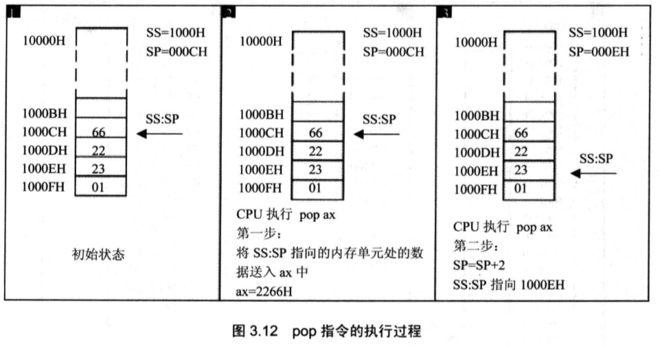

# **第一章**

**存储器**：CPU想要工作，必须向它提供指令和数据才行，而指令和数据，都放在存储器中。

**存储单元**：一个存储器可以被划分为若干个存储单元，每个存储单元从0开始编号，这个编号可以看作存储单元的地址，CPU通过这个编号来找到它。每个存储单元可以存储8个二进制即8个bit，也就是一个存储单元可以存储一个字节的数据。

**总线**：CPU通过导线和外界部件通信相连，统称为总线。总线分为三类：地址总线，数据总线，控制总线。

**地址总线**：CPU通过地址总线，来对存储单元进行寻址。如果一个CPU有N根地址线，则它的地址总线的宽度为N，可以寻找2的N次方个存储单元（因为每根线可以传输两种状态：高电平或低电平，也就是1或0，这样的话，N根线能表示的最小数是0，最大数是2的N次方-1）

**数据总线**：CPU和其他器件传输数据的通道。数据总线的宽度决定了CPU和外界的传输速度。8根数据总线一次可以传递8个二进制数据（一个字节），16根可以一次性传输2个字节。

**控制总线**：控制总线是个统称，由不同的控制线组成。每个控制线代表一种控制，譬如读取，写入等，分别由不同的控制线来控制。

**内存地址空间**：在计算机中，所有设备的存储器的存储单元，都在一个统一的逻辑存储器中（虽然设备是独立的，但是对于CPU来说，这些存储器它们其实算是一个统一的整体，只不过每个设备，拥有单独的地址区间，向这个地址区间内读写，就相当于对这个设备进行读写），这个逻辑存储器就是内存地址空间，内存地址空间的大小，受到CPU地址总线的限制。假设CPU的地址总线宽度为10，它的寻址范围是0--2的10次方-1，共1024个存储单元（2的10次方），那么这1024个可寻到的空间就是内存地址空间。（1024是地址总线宽度为10时的上限大小，也就是它最多能找到1024个，多了也找不到。譬如32位系统，最多支持4G内存，查了内存条也没用，识别不了）


# **第二章**

**寄存器**：一个典型的CPU由运算器，寄存器，控制器等组成，这些器件靠CPU内部总线连接，寄存器就是用来进行信息存储的。

**通用寄存器**：8086CPU的寄存器是16位的，可以存放两个字节。AX，BX，CX，DX这四个寄存器存放一般性的数据，称为通用寄存器。一个16位的寄存器，又可以分成两个8位的寄存器，如AX，其中低8位：0-7位构成了AL寄存器；高8位：8-15 构成了AH寄存器。                        

下图中，AX存放了0100111000100000，代表了十进制的20000，AH中存放了20000的高8位，AL存放了它的低8位。如果把AX当成两个8位寄存器来看待，则AH就可以表示一个78的十进制数，AL表示一个32的十进制数。

​                        

 **物理地址**：CPU要访问内存单元，必须知道内存单元的地址，所有的内存单元组成的存储空间是一个一维的线性空间（把所有存储器看成一个逻辑整体），每一个内存单元都有唯一的地址，称为物理地址。CPU访问内存单元前，必须要先形成一个物理地址，才能放到地址总线上发送出去。

**16位CPU**：运算器一次性最多处理16位数据；寄存器的最大宽度是16位；寄存器和运算器的通路是16位；这样的话，16位CPU一次能够处理，存储，传输的信息的最大长度是16位的。

**地址加法器：**8086CPU有20根地址总线，可以传输20位地址，寻址能力是2^20,也就是1M，而CPU又是16位的，一次性可以处理的数据是16位，也就是它的寻址能力是2^16=64KB，CPU内部采用了两个16位的地址，来合成一个20位的物理地址，达到地址总线宽度为20的寻址能力。这两个16位的地址，一个称为**段地址**，一个称为**偏移地址**。加法器采用 **段地址\*16+偏移地址 = 物理地址** 的方法，获取物理地址。（段地址是十六进制的形式，它*16，相当于十六进制向左移动1位，也就相当于二进制向左移动4位。比如十进制，你想用两个3位数表示一个4位数：1001，你可以用 100*10+1 来表示，一个道理）

**CS寄存器：**段地址存放在段寄存器中，CS是**代码段寄存器**（CS：IP指向的内存单元的内容，当作指令执行，而不是当作数据看待）**，**IP是**指令指针寄存器**。假设CS是M，IP是N，CPU将从 M*16+N 的存储单元开始读取指令并执行。也就是说，在任意时刻，CPU将CS:IP指向的内容，当作指令来执行。工作流程：**1.读取指令，将读取的指令存入指令缓冲器；2. IP = IP+读取的指令长度，从而自动指向下一条指令；3. 执行指令，重复1-3。**8086CPU开机执行的第一条指令是：CS=FFFFH,IP=0000H；


# **第三章**

**字单元：**一个存储单元能存放8bit，也就是一个**字节**。在CPU中，用16位寄存器存储一个**字型数据（16位）**，高8位放在高位字节，低8位放在低位字节。所以一个**字单元**， 就是两个地址**连续**的内存单元。譬如十进制20000（4E20H），把高位字节4E放到0号单元中，把低位字节20放到1号单元中，这样，0和1单元，就可以看作一个**起始地址是0**的字单元。如下图。

​                        

**DS寄存器：**用来存放数据的段地址（也就是将指向的单元的内容当作数据看待，而不是CS:IP那样，当作指令来看待）

将 10001H 内存单元的数据放到ax中，需要：

1. mov bx,1000H         ； 将数据的段地址先给bx
2. mov ds,bx               ； 使用bx中转，把1000H给ds，因为ds不能直接接受数据
3. mov ax,[1]               ；把 ds:1 指向的内容 给ax

#### **栈空间**

**SS寄存器：栈的段地址寄存器，**任意时刻，SS：SP指向栈顶元素。

**栈的方法：**出入栈的**单位**都是 **字型数据** 即16位数据，用**两个单元**存放**。**FILO（fist in last out 先入后出原则。)

push/pop可以操作：寄存器 和 内存单元 [...]

**push** ax ：

1. SP=SP-2，偏移地址自动-2，指向新的栈顶元素（-2是因为占用了两个内存单元），
2. 将 ax 的内容放入SS:SP指向的栈顶元素

**pop** bx ：

1. 将栈顶元素出栈，放到bx中，
2. sp=sp+2

**push入栈的过程**：栈空间是10000H-1000FH，push时，**栈顶是从高地址向低地址增长，**如下图

​                        

**pop出栈过程：**注意，出栈后，其实数据**并没有消失**，只是不再存在于栈中罢了，下次入栈时，数据会被覆盖掉

​                        

**空栈**时，SS：SP指向最高地址单元的下一个单元

​                        

**栈的大小：**受到SP的限制，SP是16位的偏移地址，变化范围是0--FFFFH，也就是64KB大小。


# **附录**：基础命令

mov 命令

```
# mov 支持的有 寄存器/数据/内存单元
mov bx,2000H ; bx=2000H
mov bx,ax    ; bx = ax
mov ax,[0]   ；ax = DS:0指向的内容

mov bx,1000H 
mov DS,bx    ; ds = bx, 注意：不能直接将数据给DS,必须中转一下

mov ax,[0]   ; ax = ds:0指向的内容
```

add 命令

```
add ax,bx    ; ax = ax+bx
```

sub 命令

```
sub ax,bx     ; ax = ax-bx
```

jmp 命令，修改CS和IP内容

```
jmp 段地址：偏移地址 ； CS=段地址，IP=偏移地址
jmp 合法的寄存器    ；  IP = 寄存器内容
```

debug 命令

1. R命令，查看修改寄存器内容
2. D命令，查看内存中的内容
3. E命令， 修改内容中的内容
4. U命令，将内存中的内容解释为汇编指令
5. T命令，执行当前 CS：IP 指向的内容
6. A命令，用汇编指令的形式写入内容

```
-r ; 查看寄存器内容
-r ax ; 修改ax中的内容
-r cs ; 修改cs中的内容


-d 段地址：偏移地址  ； 查看内容

-e 起始地址 数据 数据 ……  ；从其实地址开始，把数据依次放入存储单元中
-e 1000:0 1 2 3 ; 将0放入1000：0中，1 放入 1000：1中 ...

-u 1000：0 ；查看汇编指令

-t  ； 执行当前CS：IP指向的指令

-a 1000：0    ； 以汇编的形式写入指令，而不是机器码
```